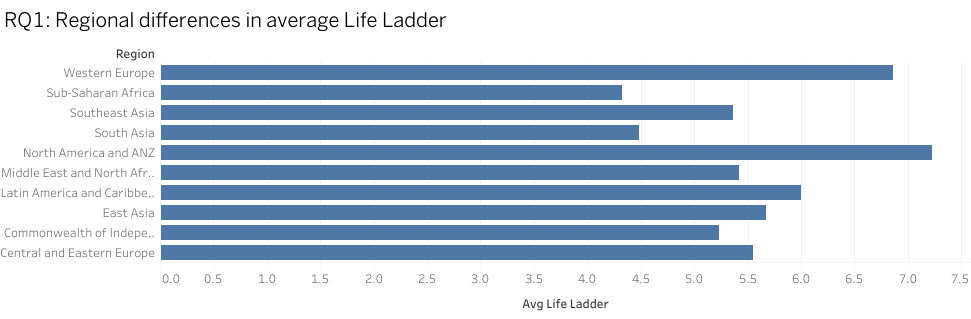
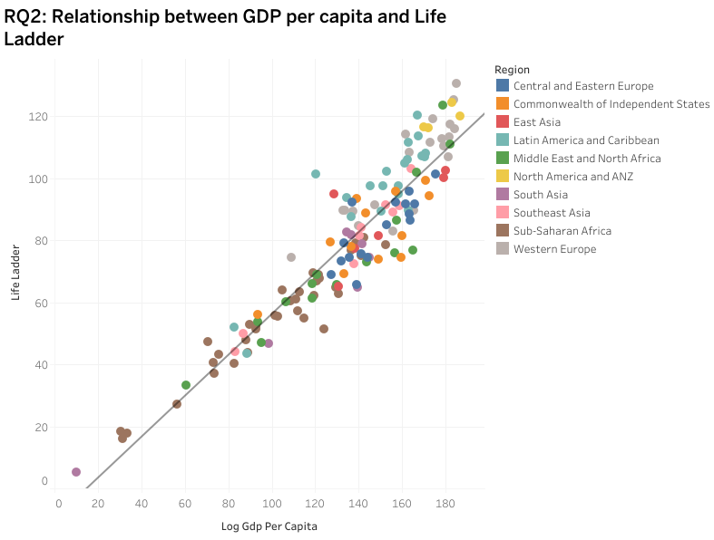
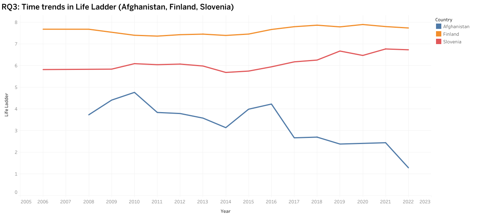

# World Happiness Report – SQL Mini Project

## Project Overview
This mini-project is part of my **data analytics portfolio**.  
I analyzed the **World Happiness Report** using three tools and produced an end-to-end workflow:
- **Excel** – initial exploration and descriptive analysis for all RQs,
- **SQL (SQLite, DBeaver)** – basic data inspection, missing-value handling, cleaning, and analytical queries,
- **Tableau Public** – visualizations and an interactive dashboard.

> A short written **report (PDF)** will be added to the repository soon.

---

## Research Questions
- **RQ1:** What are the regional differences in average happiness (Life Ladder)?
- **RQ2:** What is the relationship between GDP (Log GDP per capita) and happiness (Life Ladder)?
- **RQ3:** How has happiness evolved over time in **Afghanistan, Finland, and Slovenia**?

---

## Workflow

### 1) Excel
- Performed initial data exploration and descriptive analysis for **RQ1–RQ3**.
- Built first charts to guide the SQL work.

### 2) SQL (SQLite in DBeaver)
- **Basic inspection:** row counts, ranges, distributions.
- **Missing values:** identified and removed/filtered; created a clean dataset **`wh_clean`**.
- **Analytical queries:**
  - **RQ1:** regional averages of Life Ladder.
  - **RQ2:** Pearson correlation and simple linear regression (slope/intercept) between Log GDP per capita and Life Ladder.
  - **RQ3:** time trends for Afghanistan, Finland, Slovenia (both pivot and long format).
- Exported results to CSV for Tableau.

### 3) Tableau Public
- Imported CSVs and built three visuals (bar, scatter + trend line, line chart).
- Combined them into one **dashboard**.

**Interactive dashboard:**  
[View on Tableau Public]( https://public.tableau.com/app/profile/ana.tivold/viz/Worldhappinessreport-SQLMiniProject/Dashboard1?publish=yes) 

## Repository Structure

---

## Visualizations (Tableau)

### RQ1 — Regional Differences

**Highlights:** Western Europe and North America & ANZ have the highest averages; Sub-Saharan Africa and South Asia rank lowest.

### RQ2 — GDP vs Happiness

**Findings:** Strong positive correlation (**Pearson r ~ 0.7–0.8**).  
Linear model: *Life Ladder = a + b × Log GDP per capita*.

### RQ3 — Time Trends (AFG, FIN, SVN)

- **Afghanistan:** low and declining levels.  
- **Finland:** high and stable.  
- **Slovenia:** mid-to-high, relatively stable.

---

## Reproducibility (quick)
1. Open `sql/analysis.sql` in DBeaver (SQLite), run blocks for `wh_clean`, RQ1–RQ3.
2. Export results to CSV (see `data/`).
3. Open Tableau Public → connect CSVs → build visuals → dashboard.

---

## Tech
Excel · SQLite (DBeaver) · SQL · Tableau Public · Git/GitHub

---

## Next Steps
- Add the **written PDF report**.
- (Optional) Add Tableau **.twbx** if using Desktop license; Public users can rely on the Public link + images.

---

## 📂 Repository Structure
